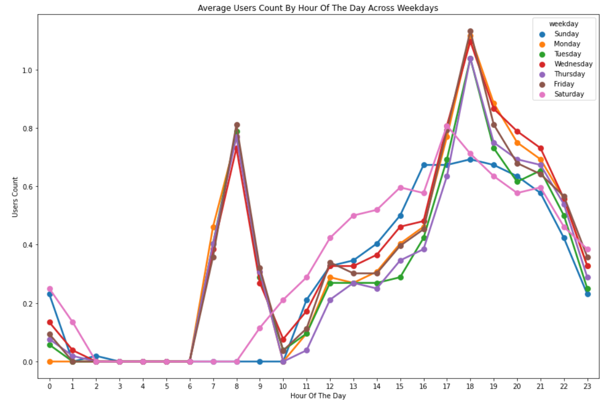

# Bike Sharing Demand Forecasting using Machine Learning

This project analyzes and predicts the demand for bike sharing services using machine learning techniques. The dataset used comes from [Kaggle's Bike Sharing Demand competition](https://www.kaggle.com/datasets/joebeachcapital/seoul-bike-sharing/data), which contains historical data including weather, seasonal, and temporal features to predict the count of rental bikes.

## Project Description

The goal of this project is to explore various machine learning algorithms and feature selection techniques to improve predictive accuracy for bike rental demand. By experimenting with different feature subsets and models, we aim to find the most effective approach for both classification and regression tasks.

Key machine learning models such as K-Nearest Neighbors (KNN), Naive Bayes, Linear and Non-linear Regression, and ensemble methods like AdaBoost and Bagging are applied. The project also integrates Mutual Information-based feature selection to optimize model inputs.

## Features

- *Data Source*: Kaggle’s Bike Sharing Demand dataset *(included in the repo under Dataset/ folder)*
- *Preprocessing*: Handling of categorical features, missing values, and feature engineering based on date/time
- *Modeling*:
  - K-Nearest Neighbors (KNN)
  - Naive Bayes
  - Linear Regression
  - Non-linear Regression
  - AdaBoost
  - Bagging Meta Estimator
- *Feature Selection*:
  - Manual exclusion of features like temperature, weather, and categorical variables
  - Mutual Information to identify most relevant features
- *Evaluation*:
  - Cross-validation (KFold)
  - Classification reports
  - Confusion matrices
  - Performance analysis on multiple feature subsets

## Visualization

Below is an example visualization showing the trend of bike rentals over time:

## Results & Discussion

Each machine learning model was evaluated using metrics like accuracy, precision, recall, and F1-score through cross-validation. 

Key findings include:

- *K-Nearest Neighbors (KNN)* with 10-fold cross-validation showed promising results, achieving a decent balance between bias and variance with tuned neighbors (e.g., n_neighbors=8).
- *Linear and Non-linear Regression* models were tested to understand their predictive power on the continuous Count variable, with varying levels of performance depending on feature combinations.
- *Naive Bayes* was fast and lightweight but underperformed compared to ensemble methods in terms of accuracy.
- *AdaBoost and Bagging* demonstrated strong performance, especially when noise and irrelevant features were removed.
- Using *Mutual Information-based feature selection*, models showed measurable improvement in both accuracy and generalization when redundant or less-informative features were excluded.
- Subsets of features (e.g., removing temperature, weather conditions, or categorical variables) revealed how sensitive each algorithm is to specific data aspects.

Overall, ensemble methods combined with proper feature selection yielded the best and most consistent results.

## Technologies Used

- *Languages*: Python
- *Libraries*:
  - Pandas, NumPy
  - Matplotlib, Seaborn
  - Scikit-learn
  - CatBoost
- *Environment*: Google Colab / Jupyter Notebook

## How to Run

1. Clone this repository or open the .ipynb file in Google Colab.
2. Make sure all required libraries are installed (scikit-learn, catboost, etc.).
3. Run the notebook cells step-by-step to perform data preprocessing, training, and evaluation.
4. The dataset is already included in the Dataset/ folder.

## Skills Demonstrated

- End-to-end machine learning pipeline
- Working with real-world time series and categorical data
- Comparative analysis across multiple ML models
- Feature selection and engineering
- Model evaluation with proper metrics and validation

---

This project highlights a comprehensive approach to model comparison and feature evaluation for predictive analytics using bike-sharing demand as a real-world case study.
